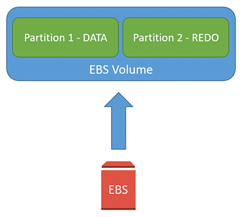

## Using Amazon EBS elastic volumes with Oracle databases - Databases without LVM

This sample demonstrates how to use elastic volumes to increase the database
storage and change the IOPS provisioned without an impact on database
availability or performance. This focuses on Oracle databases that do not use a
Logical Volume Manager (LVM) for database storage management.

>   A simple database storage architecture

This sample contains the database scripts, and OS and AWS CLI commands that are
also used in this blog [Using Amazon EBS elastic volumes with Oracle databases
(part 1):
Introduction](https://aws.amazon.com/blogs/database/using-amazon-ebs-elastic-volumes-with-oracle-databases-part-1-introduction/).
Please refer the blog for detailed, step by step, instructions.

There are two script files associated with this sample

-   **“Part 1 - Intro - OS Scripts.txt”** – This file contains the Linux OS
    commands and AWS CLI commands used, including the following

    -   Command to create a directory called customdf

    -   Command to create a file system and mount it

    -   AWS CLI commands to modify the EBS volume and increase the size

    -   Command to resize the newly created filesystem

-   **“Part 1 - Intro - DB Scripts.txt”** – This file contains the database
    scripts and commands used, including the following

    -   Script to create the EVTestTableSpace tablespace

    -   Script to verify location of the created datafile

    -   Script to create and initialize the evtesttab and other related tables
        and procedures

    -   Script to add another data file to the EVTestTableSpace and resize the
        tablespace

    -   Script to query the evtesttab table to verify that the database was
        available during the resize
