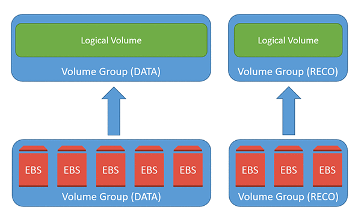

## Using Amazon EBS elastic volumes with Oracle databases - Databases using LVM

This sample demonstrates how to use elastic volumes to increase the database
storage or change the IOPS provisioned without an impact on database
availability or performance. This focuses on Oracle databases that use a Logical
Volume Manager (LVM) for database storage management.

This sample contains the database scripts, and OS and AWS CLI commands that are
also used in this blog [Using Amazon EBS elastic volumes with Oracle databases
(part 2): databases using
LVM](https://aws.amazon.com/blogs/database/using-amazon-ebs-elastic-volumes-with-oracle-databases-part-2-databases-using-lvm/).
Please refer the blog for detailed, step by step, instructions.

There are two script files associated with this sample

-   [“Part 2 - LVM - OS Scripts”](Part%202%20-%20LVM%20-%20OS%20Scripts.txt) – This file contains the Linux OS commands and
    AWS CLI commands used, including the following

    -   Commands to check and install LVM if needed

    -   Commands to create the Physical Volumes and Volume Groups

    -   Commands to create the Logical Volume and verify the configurations

    -   Command to create a directory called customdf

    -   Command to create a file system on the logical volume and mount it

    -   AWS CLI commands to modify the EBS volumes and increase the size

    -   Command to resize the Physical Volumes

    -   Command to resize the Logical Volumes

    -   Command to resize the filesystem (resize2fs)

-   [“Part 2 - LVM - DB Scripts”](Part%202%20-%20LVM%20-%20DB%20Scripts.txt) – This file contains the database scripts and
    commands used, including the following

    -   Script to create the BIGFILE tablespace called EVTestTableSpace

    -   Script to verify location of the created datafile

    -   Script to initialize/start the evtestproc procedures

    -   Script to resize the BIGFILE tablespace

    -   Script to query the evtesttab table to verify that the database was
        available during the resize
