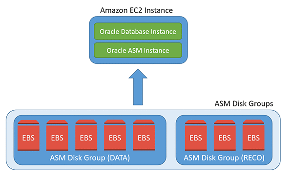

## Using Amazon EBS elastic volumes with Oracle databases - Databases using Oracle ASM

This sample demonstrates how to use elastic volumes to increase the database
storage or change the IOPS provisioned without an impact on database
availability or performance. This focuses on Oracle databases that use Oracle
Automated Storage Management (Oracle ASM) for database storage management.

This sample contains the database scripts, and OS and AWS CLI commands that are
also used in this blog [Using Amazon EBS elastic volumes with Oracle databases
(part 3): databases using Oracle
ASM](https://aws.amazon.com/blogs/database/using-amazon-ebs-elastic-volumes-with-oracle-databases-part-3-databases-using-oracle-asm/).
Please refer the blog for detailed, step by step, instructions.

There are two script files associated with this sample

-   [“Part 3 - ASM - OS Scripts”](Part%203%20-%20ASM%20-%20OS%20Scripts.txt) –
    This file contains the Linux OS commands and AWS CLI commands used,
    including the following

    -   AWS CLI commands to modify the EBS volumes and increase the size

    -   *oracleasm* command to find the device major and minor number

    -   Command to find the device name at the OS level

    -   Commands to resize the partition (fdisk)

    -   Command to update the in-memory kernel partition table after resizing

-   [“Part 3 - ASM - DB Scripts”](Part%203%20-%20ASM%20-%20DB%20Scripts.txt) – This file contains the database scripts and
    commands used, including the following

    -   Script to query the v\$asm_diskgroup view and verify the disk group and
        ASM disk sizes

    -   Script to create the BIGFILE tablespace called EVTestTableSpace

    -   Script to verify location of the created datafile and the space
        provisioned

    -   Script to initialize/start the evtestproc procedures

    -   Script to resize the BIGFILE tablespace

    -   Script to verify the new size of the tablespace after resize

    -   Script to query the evtesttab table to verify that the database was
        available during the resize
